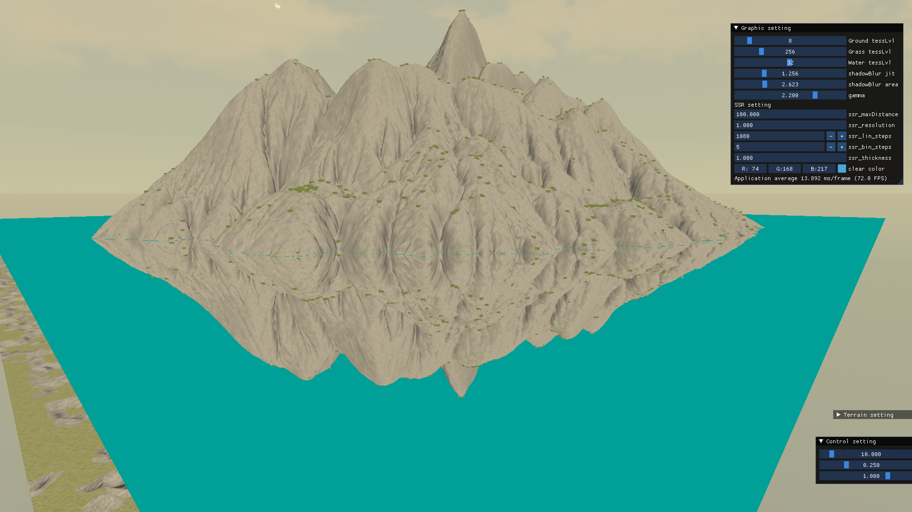
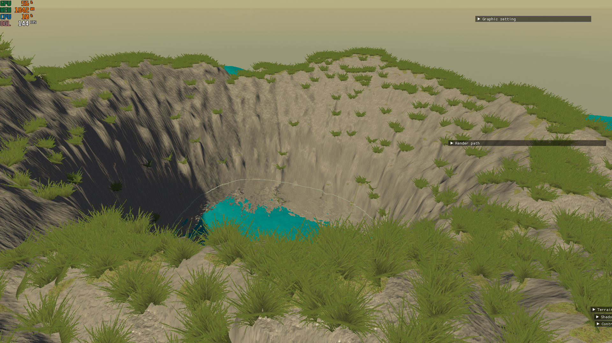
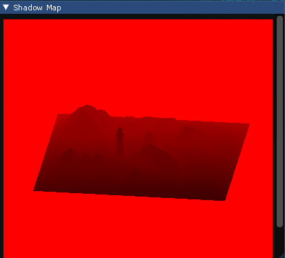
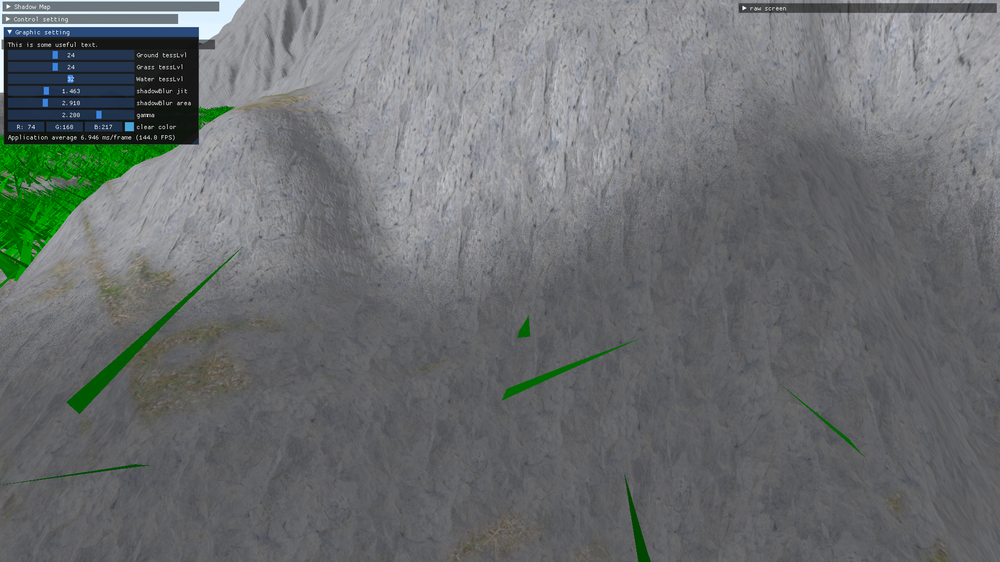
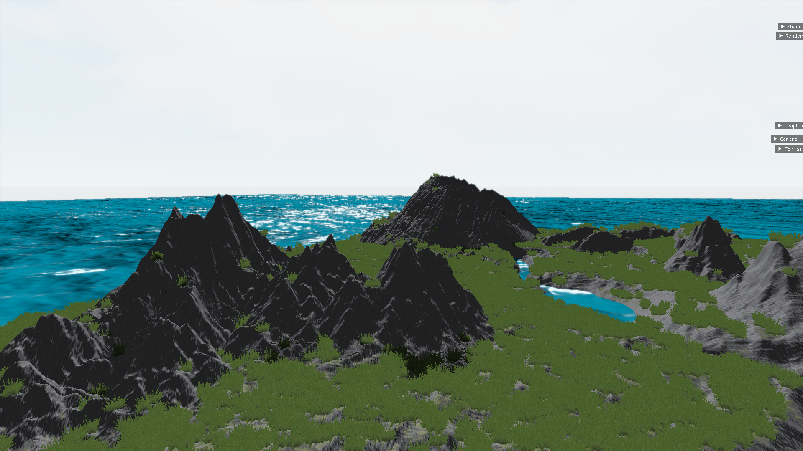
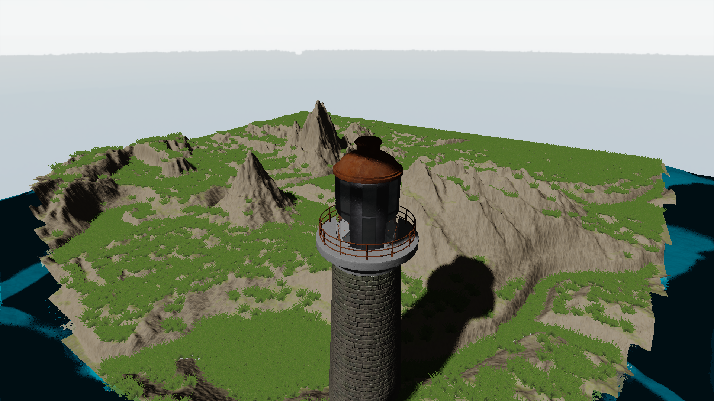

# Toy project to learn OpenGL & Graphics

그래픽스 강의를 수강한 이후 관련 분야에 흥미가 생겨 더 공부해볼 목적으로 진행한 토이 프로젝트입니다. 흥미로운 기술들을 발견하면 공부하고 그것을 해당 프로젝트에 적용 시켜왔습니다.

이후에도 지속적으로 공부하면서 다양한 기능을 추가할 예정입니다.

#### 주요 기능

- Deffered rendering
- Screen space reflection

- Shadow mapping
  
  
  
  
  - jittered PCF with 64 samples at most.
  
    
  
    파란 부분은 그림자 안쪽에 위치해 4번의 sampling만 시행한 부분이며,  붉은색~검은색 부분은 그림자 경계에 위치해 64번의 sampling을 시행한 부분이다
  
  - [reference]: https://developer.nvidia.com/gpugems/gpugems2/part-ii-shading-lighting-and-shadows/chapter-17-efficient-soft-edged-shadows-using	"GPU Gems 2, Chapter 17. Efficient Soft-Edged Shadows Using Pixel Shader Branching"
  
- Tone mapping, gamma correction

- Bloom effect

- PBR

- Normal mapping

- tessellation

- LOD

- view cone culling

#### 의미

#### TODO

- scene import/export/edit
- volumetric rendering(cloud, light, ...)