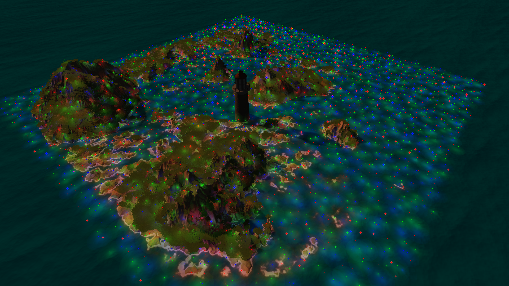
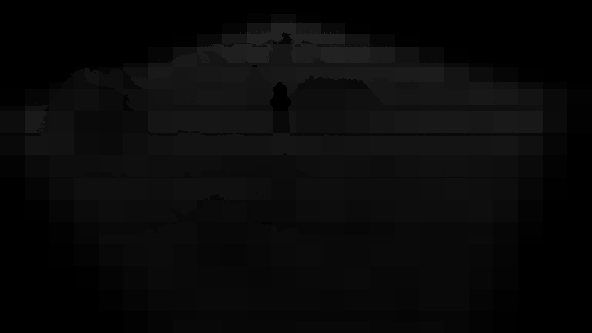
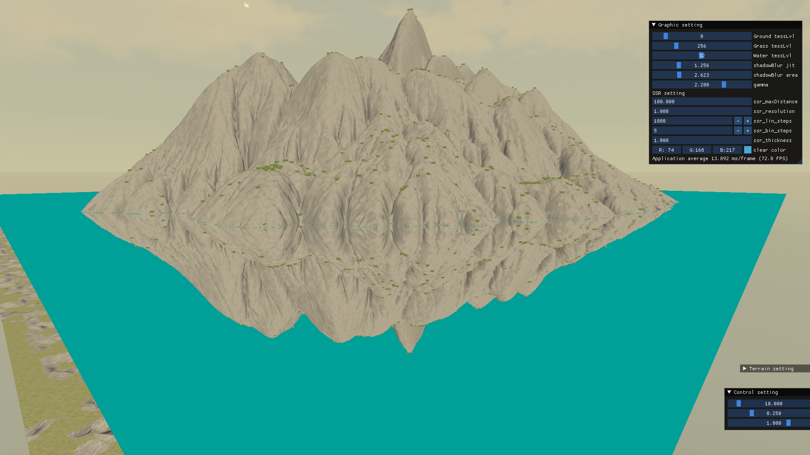
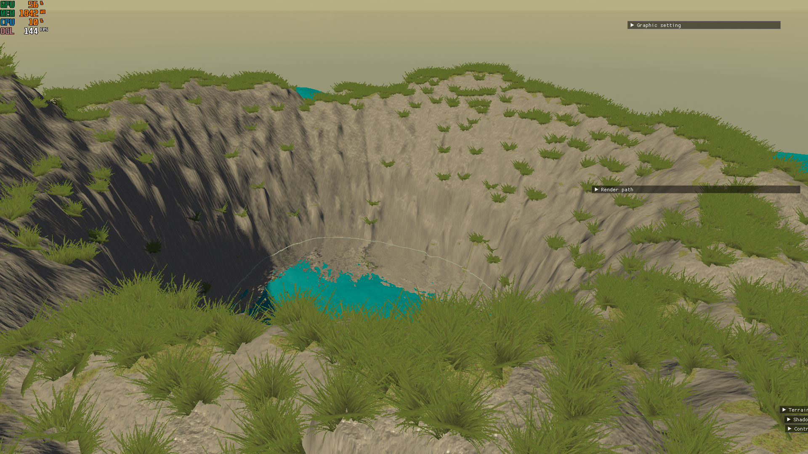
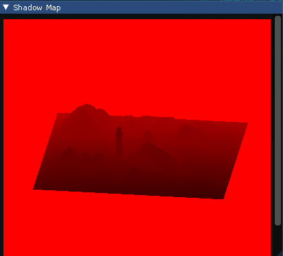
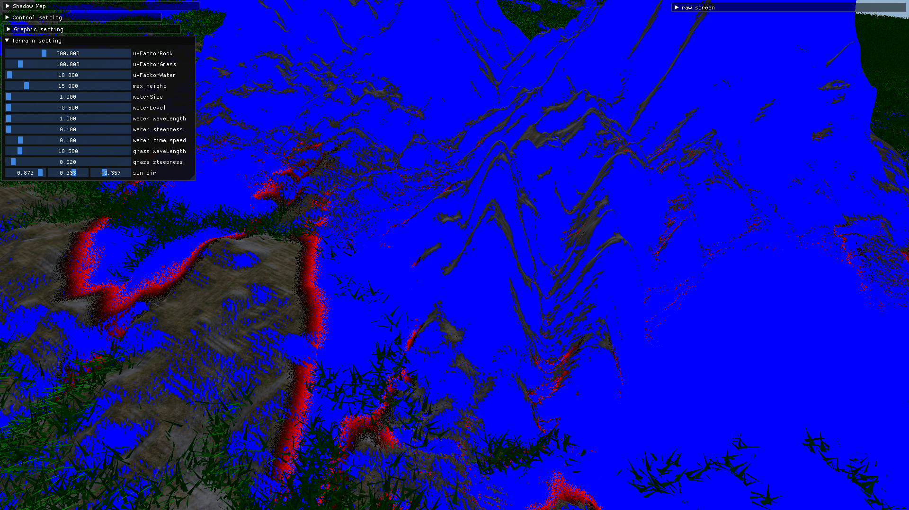
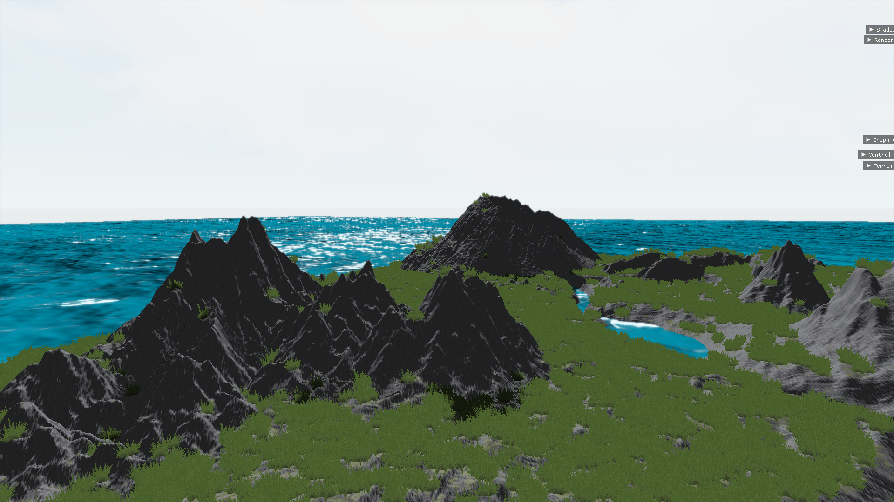

# Toy project to learn OpenGL & Graphics

  OpenGL과 여러 실시간 렌더링 기술들을 배우고 적용해보기 위한 프로젝트입니다. OpenGL 4.6(glfw)을 활용해 C++로 작성하였습니다.deferred rendering, SSR, shadow mapping, tessellation, normal mapping 등 다양한 렌더링 기술들을 학습할 수 있는 기회가 되었습니다. 

  최적화를 위해 cluster shading, viewcone을 이용한 culling, LOD 를 학습하고 적용했습니다. 특히 cluster shading을 적용해 65,536 개의 동적 광원의 lighting을 약 56ms 만에 달성할 수 있었습니다.

**Keyword** : clustered deferred rendering, SSR, Shadow map, PCF, Bloom effect, Normal mapping, tessellation

**Demo Video** : https://www.youtube.com/watch?v=rZhjAB3UKO8

#### 주요 기능

- Deffered rendering with cluster shading

​			Composition of gBuffer

| buffers       | R          | G          | B          | A     |
| ------------- | ---------- | ---------- | ---------- | ----- |
| PositionMetal | Position X | Position Y | Position Z | Metal |
| NormalRough   | Normal X   | Normal Y   | Normal Z   | Rough |
| AlbedoSpec    | Albedo R   | Albedo G   | Albedo B   | AO    |

​		Cluster shading

​											[성능 : light culling & lighting in 4.13ms]

- Screen space reflection

- Shadow mapping
  
  
  
  
  - jittered PCF with 64 samples at most.
  
    
  
    파란 부분은 그림자 안쪽에 위치해 4번의 sampling만 시행한 부분이며,  붉은색~검은색 부분은 그림자 경계에 위치해 64번의 sampling을 시행한 부분이다
  
  - **reference** :  https://developer.nvidia.com/gpugems/gpugems2/part-ii-shading-lighting-and-shadows/chapter-17-efficient-soft-edged-shadows-using	"GPU Gems 2, Chapter 17. Efficient Soft-Edged Shadows Using Pixel Shader Branching"
  
- HDR, gamma correction

- Bloom effect

- PBR

- Normal mapping

- tessellation

- LOD
  - terrain tessellation

  - grass

- view cone culling

#### 어려웠던 점

- Viewcone으로 culling을 수행할 때, tessellation을 사용하는 지형의 경우 렌더링하기 전까지 실제 위치를 알 수 없어 일부분이 렌더링 되지 않는 문제가 있었습니다. 이를 해결하기 위해 지형에 한해서 y축을 무시하고 xz 평면에서 수평 시야각을 기준으로 culling을 수행하여 해결할 수 있었습니다.
- Shadow mapping을 통해 부드러운 그림자를 구현하려 했지만 단순한 PCF로는 여러 강도의 그림자가 층을 이루는 어색한 결과 나오는 문제와 많은 성능을 요구하던 문제가 있었습니다. 이를 해결하기 위해 [Gpu Gems2](https://developer.nvidia.com/gpugems/gpugems2/part-ii-shading-lighting-and-shadows/chapter-17-efficient-soft-edged-shadows-using)을 참고해 불필요한 연산을 줄여 성능을 증가 시키고 jittering을 통해 자연스러운 그림자가 렌더링 되도록 할 수 있었습니다.

#### TODO

- scene import/export/edit
- volumetric rendering(cloud, light, ...)